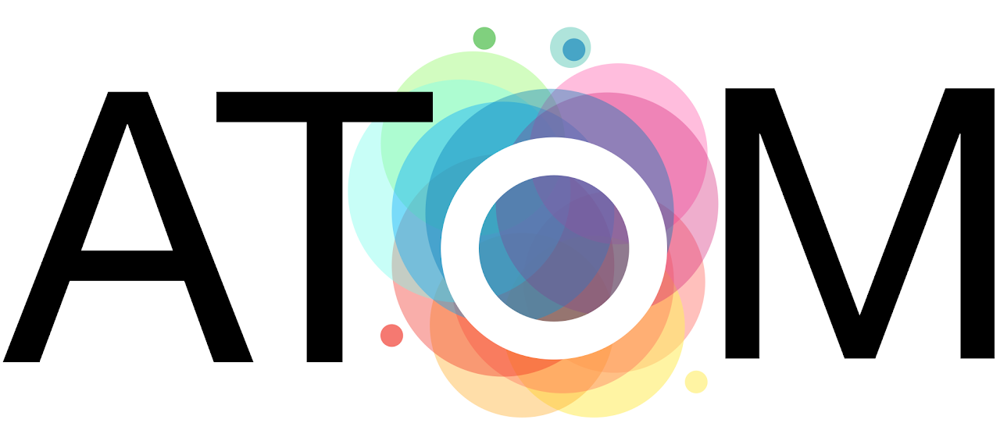

AToM-OpenMM v8.2
====================



The Alchemical Transfer Method for OpenMM (AToM-OpenMM) is an extensible Python package for the estimation of absolute and relative binding free energies of molecular complexes. It implements the [Alchemical Transfer Method (ATM)](https://pubs.acs.org/doi/10.1021/acs.jcim.1c01129) with  asynchronous parallel replica exchange molecular dynamics with the [OpenMM](https://github.com/openmm) library. The AToM software can be deployed on workstations or cluster nodes with one or more GPUs.

This version of AToM uses [ATMForce](https://github.com/openmm/openmm/pull/4110) in the 8.2.0 or later versions of [OpenMM](https://github.com/openmm/openmm). 

Credits
-------

This software is developed and maintained by the [Emilio Gallicchio's lab](http://www.compmolbiophysbc.org) with support from current and past grants from the National Science Foundation (ACI 1440665 and CHE 1750511) and the National Institutes of Health (R15 GM151708).

Maintainer/Author:

- Emilio Gallicchio <egallicchio@brooklyn.cuny.edu>

Contributors:

- Sheenam Khuttan <sheenam@sandboxquantum.com>
- Joe Z Wu <jwu1@gradcenter.cuny.edu>
- Solmaz Azimi <sazimi@gradcenter.cuny.edu>
- Baofeng Zhang <BZhang@brooklyn.cuny.edu>
- Rajat Pal <rajatfor2014@gmail.com>

The asynchronous replica exchange method was first implemented in the [AsyncRE](https://github.com/ComputationalBiophysicsCollaborative/AsyncRE) package for the IMPACT program.

Citations
---------

Please [cite us](http://www.compmolbiophysbc.org/publications) if you use this software in your research:

- [Relative Binding Free Energy Calculations for Ligands with Diverse Scaffolds with the Alchemical Transfer Method](https://pubs.acs.org/doi/10.1021/acs.jcim.1c01129)

- [Relative Binding Free Energy Estimation of Congeneric Ligands and Macromolecular Mutants with the Alchemical Transfer with Coordinate Swapping Method](https://arxiv.org/abs/2412.19971)

- [Alchemical Transfer Approach to Absolute Binding Free Energy Estimation](https://pubs.acs.org/doi/10.1021/acs.jctc.1c00266)

- [Asynchronous Replica Exchange Software for Grid and Heterogeneous Computing](http://www.compmolbiophysbc.org/publications#asyncre_software_2015)

Installation & Usage
--------------------

It is recommended that the installation is performed in a personal python environment (`miniforge`, `miniconda`, `conda`, or similar). AToM-OpenMM requires the `openmm`, `configobj` and `numpy` python modules. 

This version of AToM-OpenMM requires OpenMM 8.2.0 or later. This conda command installs the necessary requirements:
```
mamba create -n atm8.2.0 -c conda-forge python=3.11 openmm=8.2.0 ambertools openmmforcefields configobj setproctitle r-base espaloma=0.3.2 
mamba activate atm8.2.0
```
`setproctitle` above is optional but useful to track the names of the processes started by AToM-OpenMM. The `ambertools`, `openmmforcefields`, and `espaloma` packages are not actual dependencies; they are used to setup the molecular systems. `openmmforcefields`, in particular, is used to assign force field parameters using OpenFF, GAFF, or `espaloma`. [`espaloma`](https://github.com/choderalab/espaloma) is a machine-learning system by the Chodera lab to assign force field parameters.  `r-base` with the `UWHAM R package` (see below) is required for free energy estimation. See [examples](examples/) for examples and tutorials.

Finally, install AToM-OpenMM:

- From the latest sources:
```
git clone https://github.com/Gallicchio-Lab/AToM-OpenMM.git
cd AToM-OpenMM
pip install .
```

- From the latest release:
```
wget https://github.com/Gallicchio-Lab/AToM-OpenMM/archive/refs/tags/v8.2.1.tar.gz
tar zxvf v8.2.1.tar.gz
cd AToM-OpenMM-8.2.1
pip install .
```

And this will install the UWHAM R package:
```
Rscript -e 'install.packages("UWHAM", repos = "http://cran.us.r-project.org")' 
```

While we strive to develop and distribute high-quality and bug-free software, keep in mind that this is research software under heavy development. AToM-OpenMM is provided without any guarantees of correctness. Please report issues [here](https://github.com/Gallicchio-Lab/AToM-OpenMM/issues). We welcome contributions and pull requests.

Documentation
-------------

[AToM-OpenMM User Guide](https://www.compmolbiophysbc.org/atom-openmm)

See [examples](examples/) for examples and tutorials.

Licensing
---------

 This software is licensed under the terms of the [GNU Lesser General Public License](https://opensource.org/license/lgpl-3-0). See [LICENSE](LICENSE)
